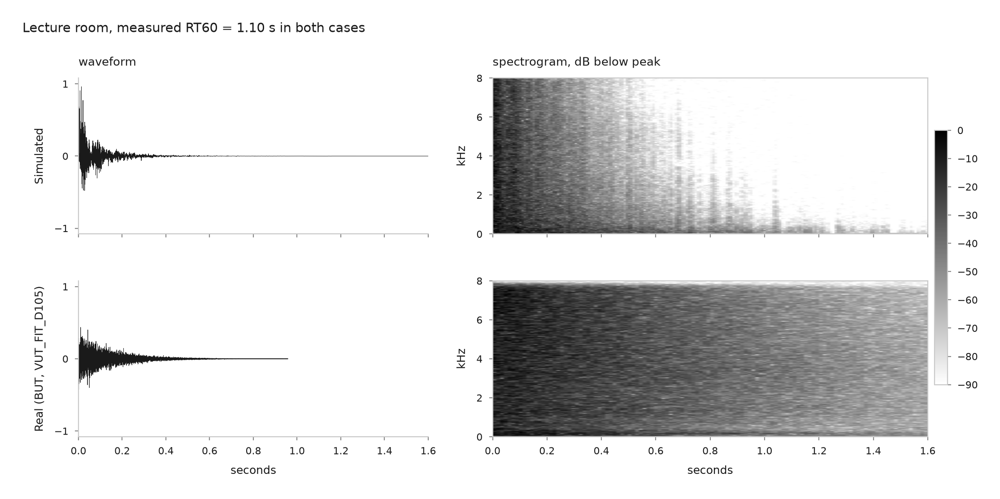
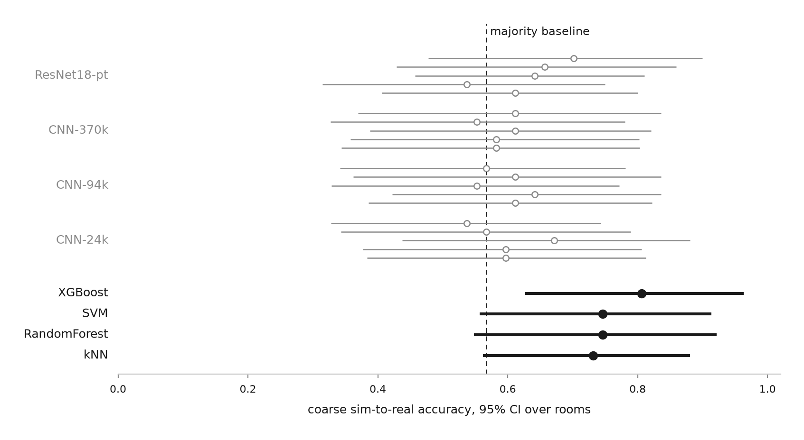
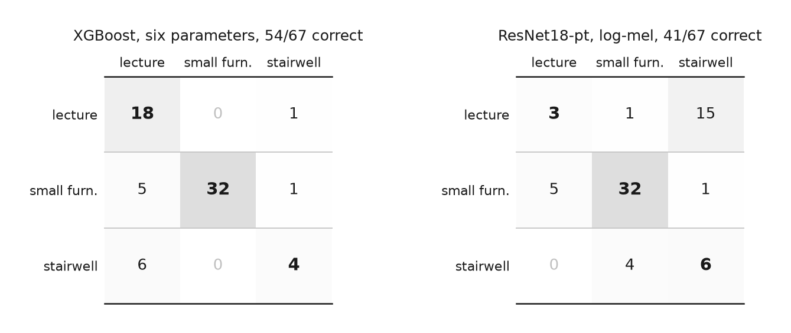
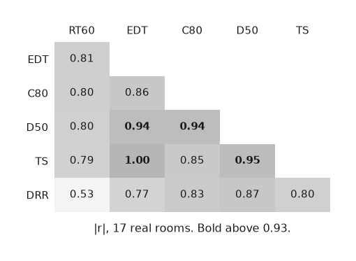

# ASC-26: Acoustic Space Classification

[](https://doi.org/10.5281/zenodo.21771185)

Given the impulse response of a room, the echo left by one sharp sound, can a model say
what kind of room it is?

Every model here is trained on simulated rooms only, then tested on real recordings from
17 rooms it has never heard, measured by other people in other buildings.

The answer splits in two. At the level of what a room is used for, office against
meeting room, nothing works: no model beats guessing. Acoustically those are the same
object, a small furnished box, and no amount of modelling separates them. Group the
rooms by acoustic type instead, small furnished against lecture hall against stairwell,
and six standard acoustic parameters put 15 of the 17 rooms in the right group. Always
guessing the most common group gets 10. Twenty runs of four convolutional networks,
given the same recordings, never reach the weakest of the four parameter-based
classifiers.

The catch is that seventeen rooms is not enough to prove any of it. An exact McNemar
test on those rooms gives p = 0.125, well short of significance, and a survey of 20
public corpora found that seventeen is close to all the labelled real rooms that exist
to test on. Every classical model came out above every neural run, but on seventeen
rooms that is a direction observed in one small sample, not a demonstrated property of
the two approaches.



*Figure 1. A simulated and a real lecture room whose measured RT60 is identical at
1.10 s, after the onset alignment and peak normalisation the models are given. The six
parameters return the same numbers for the two rows. The signals differ anyway: the
simulated tail falls into digital silence and its spectrogram empties out, while the real
recording sits on its own noise floor for the whole window. A network trained on the top
row and tested on the bottom one has to bridge that on its own.*

A room-acoustics simulator (`pyroomacoustics`) generates 5,000 labelled RIRs over
10 room types with frequency-dependent per-surface absorption over four geometry
families. Classifiers are fitted on this synthetic set and tested on 19 real rooms
assembled from BUT ReverbDB, Aachen AIR and the ACE Challenge. Evaluation is reported
at two levels: fine (functional labels as recorded) and coarse (acoustic archetypes,
collapsed after prediction). The coarse map was committed on 21 July 2026, six weeks
before the results reported here, so it could not have been chosen to fit them. The four classes present in both domains
are office, meeting room, lecture room and stairwell; the real subset restricted to
these is 17 rooms, 67 RIRs.

Two model families are compared on the same split, labels and test set: six broadband
room-acoustic parameters (RT60, EDT, C80, D50, Ts, DRR), the quantities ISO 3382 is
built around, with four standard classifiers, and log-mel
spectrograms with four convolutional architectures spanning 24k to 11M parameters, each
over five seeds. The two are not fed identical signals: the network gets a fixed 3.2 s
window while the parameters are estimated over the whole file, so 17.3% of the synthetic
training RIRs in the shared classes reach it already cut, 61% of the stairwells against
0% of the offices. `src/control_truncation.py` re-runs the feature-based arm on exactly
the signal the network is given and the ranking does not move: coarse accuracy is
unchanged to three decimals for RandomForest, SVM and kNN, and XGBoost drops from 0.806
to 0.761 and from 15 to 14 rooms, still above all 20 neural runs.

## Results

Coarse sim-to-real. Accuracy and its interval are per RIR over the 67 recordings, the
interval bootstrapped over the 17 rooms rather than over the RIRs. The Rooms column is a
separate quantity, one majority vote per room, which is why the baseline row reads 0.567
per RIR and 10 of 17 per room: 38 of the 67 recordings belong to the largest class but 10
of the 17 rooms do. The neural rows are means over
five seeds. The classical rows are single fits, which costs nothing for three of them:
kNN and SVC have no random component and XGBoost at library defaults never resamples,
measured at 0.806 with zero spread over five seeds. RandomForest is the exception at
0.761 +/- 0.009, always on the same 15 rooms; the row shows its seed-42 fit.

| Model | Accuracy | 95% CI | Rooms |
|---|---|---|---|
| XGBoost (six parameters) | 0.806 | 0.627-0.964 | 15/17 |
| RandomForest | 0.746 | 0.548-0.922 | 15/17 |
| SVM | 0.746 | 0.557-0.914 | 15/17 |
| kNN | 0.731 | 0.562-0.881 | 15/17 |
| ResNet18 (ImageNet-pretrained) | 0.630 ± 0.061 | | 10.8/17 |
| CNN-94k | 0.597 ± 0.037 | | 10.2/17 |
| CNN-24k | 0.594 ± 0.050 | | 10.2/17 |
| CNN-370k | 0.588 ± 0.025 | | 10.2/17 |
| Majority class | 0.567 | | 10/17 |



*Figure 2. Coarse sim-to-real accuracy with 95% intervals bootstrapped over the 17
rooms. Classical models in black, the 20 neural runs in grey and plotted individually
rather than averaged. All four classical models rank above all twenty neural runs, but
three of the four have a lower bound sitting on the majority baseline, and every interval
is wider than the gap between the two groups.*



*Figure 3. Coarse confusion for the best model of each kind on the 67 real RIRs, rows
true and columns predicted. Both fail on the same axis, the small-to-large size gradient,
in opposite directions: the parameters read 6 of 10 stairwells as lecture rooms, the
network reads 15 of 19 lecture rooms as stairwells.*

Over the 20 neural runs coarse accuracy ranges from 0.537 to 0.702, so the best single
run of the best network still falls short of the weakest classical model.

None of this is statistically significant, and that is the main result of the study.
An exact McNemar over the 17 rooms puts every feature-based model at 15/17 against the
baseline's 10/17, six discordant rooms to one, p = 0.125. Feature-based against neural,
per seed, gives p between 0.065 and 0.453. Scored per RIR instead the same comparisons
reach p = 0.004 to 0.052, but that treats 67 measurements from 17 rooms as independent,
which is the assumption the clustered intervals above exist to reject. Seventeen rooms
cannot resolve differences of this size. `src/significance.py` reproduces the tests.

At the fine level nothing works. The baseline is 0.358 and the best of the eight models
is XGBoost at 0.418, with an interval of 0.206 to 0.644 that contains the baseline. The
single highest fine accuracy anywhere in the study, ablations included, is 0.463, from
RandomForest given RT60 and nothing else. Office and meeting room are not separable in
this data, which is what the coarse level exists to work around.

Four controls:

Capacity: accuracy is flat from 24k to 11M parameters and under ImageNet pretraining,
within the seed spread.

Domain normalization: recomputing BatchNorm statistics on the unlabelled real set
(AdaBN) lowers coarse accuracy for all four architectures.

Corpus: the result is not carried by one of the three sources, nor by the one feature
that shifts between them. Dropping DRR costs between 0.000 and 0.030 coarse accuracy
depending on the model, so the 8 dB corpus offset in that feature is not what the
classifiers are reading. Scored separately by source,
XGBoost gets 0.829 on the 7 BUT rooms, 0.650 on the 4 from AIR and 1.000 on the 6 from
ACE, and the other three models follow the same pattern. ACE is the easiest because it
contributes no stairwells, which is the class both arms fail on.

Feature redundancy: the six parameters are integrals of the same energy decay curve, and
on the real set their pairwise |r| spans 0.53 to 1.00. RT60 alone matches all six on
coarse accuracy, 0.757 against 0.757, and reaches 12 to 14 rooms where the six together
reach 15. DRR is the exception that proves the point: it is the least redundant of the
six and also the one whose median shifts 8 dB between corpora, which is how far the
microphone was from the source rather than what the rooms were like.



*Figure 4. Absolute correlation between the six parameters over the 17 real rooms, lower
triangle only. EDT and Ts are the same variable to two decimals. DRR is the one carrying
something the others do not, and it is also the one contaminated by microphone distance.*

## Limitations

Seven things stand between this and a result you could rely on. None of them was fixed,
and each says what fixing it would take.

- Seventeen rooms is not enough to prove anything. A survey of 20 public corpora found
  no larger labelled set to move to, so the only fix is to go out and measure more rooms.
  That was not done.
- It is not established whether the networks failed at the task or at this simulator. In
  the synthetic rooms the source and microphone are dropped anywhere in the air rather
  than at speaker and ear height, the tail decays into digital silence where a real
  recording sits on a noise floor, and the frequency shape of the absorption is three
  tilts written by hand rather than measured materials. A network reads the whole
  picture, so it sees all of that; a slope fitted to the decay does not. Rebuilding the
  simulator and retraining would separate the two explanations. That was not done.
- The networks were never tuned. Each architecture got one learning rate and one epoch
  budget, read off its validation curve, and no search was run. What the data supports is
  that these four networks did not transfer, not that networks transfer worse.
- The 0.806 at the top of the table is the best of four models, picked on the same
  seventeen rooms it is then reported on, alongside 56 ablation evaluations with no
  correction for multiplicity. The clean way is to fix the model before looking at the
  test set, which is no longer possible here.
- The six parameters are effectively one. RT60 alone matches all six on coarse accuracy,
  0.757 against 0.757, and their pairwise correlation on the real set runs from 0.53 to
  1.00 with two of them identical to two decimals. That is a result rather than a defect,
  but it means "six acoustic parameters" oversells what the classifier is reading.
- The parameters are not computed the way ISO 3382 defines them. The standard specifies
  each one per octave band; here each is a single number over the whole spectrum. EDT is
  taken from the first point where the decay curve crosses -10 dB, where the standard
  fits a line through that whole range, which leaves it sensitive to one strong early
  reflection. Only RT60, the one the ablation shows is doing the work, was checked
  against published ground truth: on the two measurements of one ACE room it came out 8%
  and 15% high. Reimplementing all six to the standard would change every number here and
  was not done.
- Whether the networks leaned on file length was not measured. Simulated files run about
  1.9 times their RT60, real recordings about 1.3 times theirs, and a classifier given
  nothing but file length scores 0.569 in-sim and 0.343 on the real set, under the 0.358
  baseline. So the cue is strong in training and worse than guessing at test time.
  Cropping every file to a common length and retraining would settle whether the networks
  used it. That was not done.

One further imbalance, partly checked. The 17 rooms are 9 from BUT, 6 from ACE and 4 from
AIR, with median RT60 of 1.10, 0.47 and 0.77 s, and the classes are not spread evenly:
ACE has no stairwells, and the stairwell class is two rooms in total. The per-corpus
scores above show the result is not carried by one source, but two rooms is two rooms.
Rooms carry 2 to 5 RIRs each, so a room-level vote can turn on one measurement.

## Related work

This project searched hard for datasets and barely at all for papers. That is a failure
of the work, not of the field: the four below were there the whole time and should have
been read before starting.

- Shah, Raj, Harras, ["Inferring Room Semantics Using Acoustic
Monitoring"](https://ieeexplore.ieee.org/document/8168153), MLSP 2017. Reports the
  same split this repo treats as its own organizing observation, rooms defined by what
  they are used for against rooms defined by how they are built, tested on a building
  the models had never seen.
- Papayiannis, Evers, Naylor, ["End-to-End Classification of Reverberant Rooms Using
  DNNs"](https://dl.acm.org/doi/abs/10.1109/TASLP.2020.3033628), IEEE/ACM TASLP 2020.
  Same ACE data, same features-versus-network axis, and reaches the opposite conclusion
  under a closed-set protocol with reverberant speech rather than exact RIRs.
- Foy, Deleforge, ["Mean absorption estimation from room impulse responses using
  virtually supervised learning"](https://arxiv.org/abs/2109.00393), JASA 150(2), 2021.
  Virtually supervised learning is the field's own name for the sim-to-real setup used
  here.
- Srivastava, Deleforge, Vincent, ["Realistic sources, receivers and walls improve the
  generalisability of virtually-supervised blind acoustic parameter
  estimators"](https://arxiv.org/abs/2207.09133). Runs the experiment an earlier version
  of this project claimed a result from without performing: whether a more realistic
  simulator helps or hurts.

## Data

The synthetic set (5,000 labelled RIRs, 10 room types, 16 kHz PCM-16) is archived with
a datasheet at [10.5281/zenodo.21771185](https://doi.org/10.5281/zenodo.21771185) and is
usable independently of the analysis in this repository. The real evaluation set is
assembled from third-party corpora. Their audio is not redistributed here;
`src/real_test.py` rebuilds the manifest from local copies, and `data/real/` holds
only the extracted parameter table and the file listing.

The real rooms come from three corpora, each obtainable from its own publisher under
its own terms:

- BUT ReverbDB. Szoke, Skacel, Mosner, Paliesek, Cernocky, ["Building and evaluation
  of a real room impulse response dataset"](https://arxiv.org/abs/1811.06795),
  IEEE JSTSP 13(4), 2019.
- Aachen AIR. Jeub, Schafer, Vary, ["A binaural room impulse response database for the
  evaluation of dereverberation algorithms"](https://dl.acm.org/doi/10.5555/1700307.1700398),
  DSP 2009.
- ACE Challenge. Eaton, Gaubitch, Moore, Naylor, ["Estimation of room acoustic
  parameters: the ACE challenge"](https://ieeexplore.ieee.org/document/7486010/),
  IEEE/ACM TASLP 24(10), 2016.

Simulation uses pyroomacoustics: Scheibler, Bezzam, Dokmanic, ["Pyroomacoustics: a
Python package for audio room simulation and array processing
algorithms"](https://arxiv.org/abs/1710.04196), ICASSP 2018.

The MIT license covers the code and the synthetic data. The tables under `data/real/`
and `results/` are derived from the three corpora above and remain subject to their
terms.

## Pipeline

| Step | Script |
|------|--------|
| Room-type taxonomy and geometry | `src/room_types.py` |
| Synthetic RIR generation | `src/simulate.py` |
| Feature extraction, six parameters | `src/utils.py` |
| Features from a manifest | `src/build_dataset.py` |
| Real test set assembly | `src/real_test.py` |
| Feature-based benchmark | `src/train.py` |
| Neural benchmark | `src/nn/train_nn.py` |
| Paired tests between the two arms | `src/significance.py` |
| Truncation control | `src/control_truncation.py` |
| README figures | `src/figures.py` |

Metrics land in `results/metrics.csv` and `results/metrics_nn.csv`, per-sample
predictions on the real set in `results/preds.csv` and `results/preds_nn.csv`. Setup in
[INSTRUCTIONS.md](INSTRUCTIONS.md), working notes in [notes.md](notes.md).

## Status

Complete, September 2026, no further work planned.

What stands, scoped to what was actually run: at the coarse level these four classical
models on these six parameters beat the majority baseline on rooms they were never
trained on, and these four architectures, untuned and trained on this simulator, do not.
Every one of the 4 classical models lands above every one of the 20 neural runs, and none
of it reaches significance on 17 rooms. The 0.806 in the table is the best of the four,
picked on the same test set.

What was withdrawn: earlier versions reported that the drop from simulation to reality
grew with network size. That came from running each network once. Run five times each,
the differences turn out to be smaller than the variation between runs of the same
network, so the claim was removed. Those earlier numbers were deleted rather than struck
through; the previous text is in the git history.

MSc side project, Uppsala University (Machine Learning & Statistics).

## Citation

```bibtex
@dataset{bimbato2026asc26,
  author    = {Bimbato, Tommi},
  title     = {{ASC-26: A Synthetic Room Impulse Response Dataset
                for Room-Type Classification}},
  year      = {2026},
  publisher = {Zenodo},
  version   = {1},
  doi       = {10.5281/zenodo.21771185},
  url       = {https://doi.org/10.5281/zenodo.21771185}
}
```
